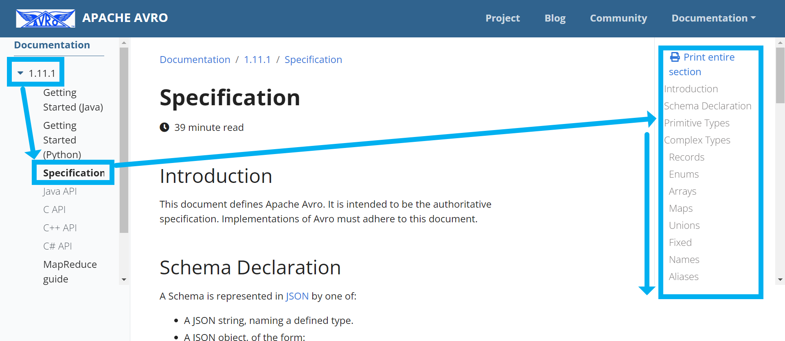

## Apache Avro 는 무엇일까

kafka 를 통한 메시지 큐 통신시에는 String 으로 직렬화/역직렬화해서 보내는 게 가장 원시적인 방법이고 가장 편한 방법이다. 받는측, 보내는 측에서 어떤 타입으로 보내는지 합의가 이뤄진다면 확실하게 실행할 수 있는 방법이다. 즉 KafkaListener 에서도 String으로 받아서 ObjectMapper 와 같은 객체를 통해 직렬화 역직렬화를 하는 방식이다. 

Java, Kotlin 으로 `Schema`, `Payload`, `Field`, `Type` 을 메시지 송수신을 위한 객체 하나마다 각각 따로 정의해서 메시지 큐에서 데이터의 송수신을 하는 방법도 있다. 이렇게 하면 KafkaListener 에서 바로 객체로 받지는 못하고 ConsumerRecord 나 String 객체로 받은 후 역직렬화 작업을 해줘야 한다. 

마지막으로는 AVRO 를 사용하는 방식이 있다. Avro 를 사용하면 json 명세서를 메시지 큐를 공유하는 각각의 MSA 마다 AVRO json 명세 파일을 서로 공유하면 서로 간의 타입이 호환이 안되는 문제를 해결할 수 있다. 

한 가지 단점으로는 코틀린에서는 또 따로 이것 저것 찾아봐야 한다는 점, Type 변환을 위해 Avro 스키마 명세를 찾아봐야 한다는 점이 있다. 

 

## 발음 조심

일단 발음을 조심해야 한다. 외국인 앞에서 `에이브로` 라고 발음하면 화들짝 놀란다. 우리야 `에이브로`라고 부르는게 편하지만, 영어권에서는 꽤 놀라는 듯 해보인다. Udemy 강사가 자꾸 `아!브로` 이렇게 발음을 해서 `왜 그런거지?` 하고 생각했는데 `에이브-`라는 발음이 꽤 조심스러울 수 있겠다 싶었었다. 

## Avro 를 사용해야 할 경우

타입이 복잡해지거나 Payload 의 종류가 점점 많아지면 Java나 Kotlin 으로 일일이 모두 Avro에서 지원하는 타입으로 모든 타입을 정의하기가 쉽지 않다. 간단한 프로젝트면 그냥 타입으로 선언해서 사용하면 되지만, 메시지큐에 전달해야 하는 객체의 종류가 많아지면 결국은 나중에 중노동이 된다. 

그래서 Avro 를 사용하는구나 싶었었다. 

 

## Avro 를 사용하는 것이 불편한 경우

각종 타입들은 Avro 공식 페이지에서 찾아가면서 맞춰야 하고 `-Converter` 나 `-Serializer` 를 작성해야 한다는 단점이 있다. 그런데 이런 단점은 나중에 Payload, Schema 를 2중 3중으로 중첩해서 작성해야 하는 경우가 생기면 Avro 를 사용하는 것이 훨씬 낫겠다는 생각으로 돌아가게 되는 듯 하다. 

만약 단발성 프로젝트라면 굳이 Avro 를 사용하지 않아도 될것 같다. 

그냥 Shema, Payload 타입을 선언해서 직접 연결해서 Java, Kotlin 타입을 전달해주면 KafkaListener 에서 Serialize, Deserialize가 가능해진다. 

 

## Avro 타입 명세를 확인하는 방법

[avro.apache.org](https://avro.apache.org/) 을 방문한다. 

우측 상단의 `Documentation` \> `1.11.1 (Current)` 클릭 

 

좌측 사이드 바에서 `Specification` 을 클릭한다. 

 

예를 들어 UUID를 어떻게 변환하는지를 찾아보면 아래와 같다. 의역을 해보면, UUID는 `type` 으로는 `string` 이지만, logical type 은 `uuid` 라고 명시해주면 된다.

 

---

## Avro 를 사용하지 않을 경우의 예제 코드

