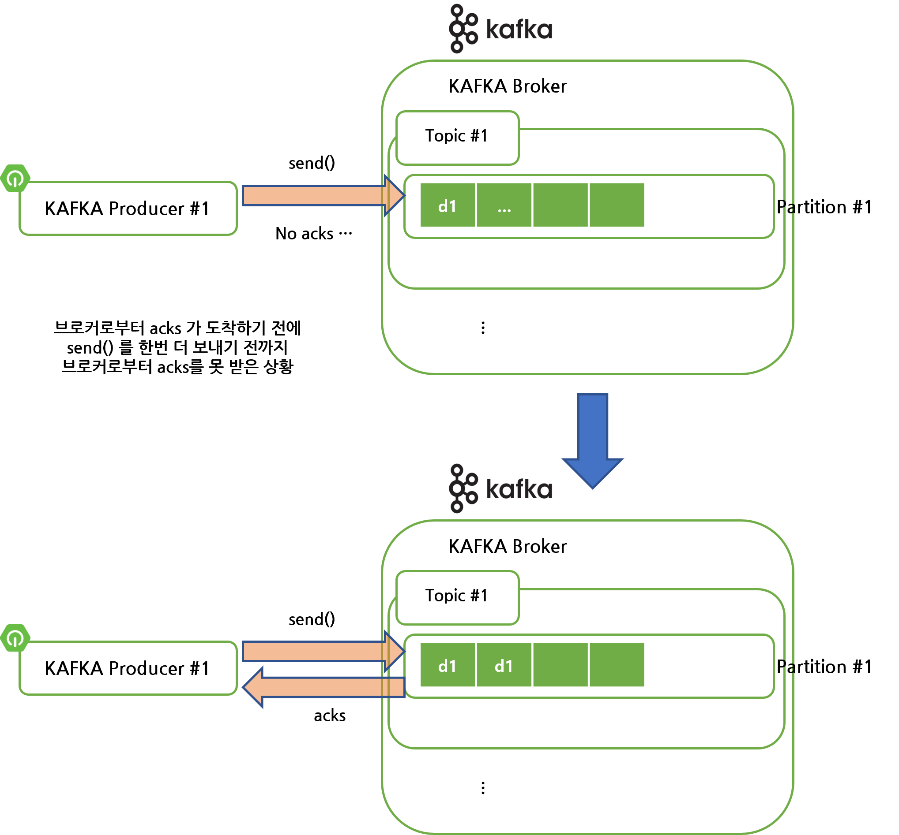
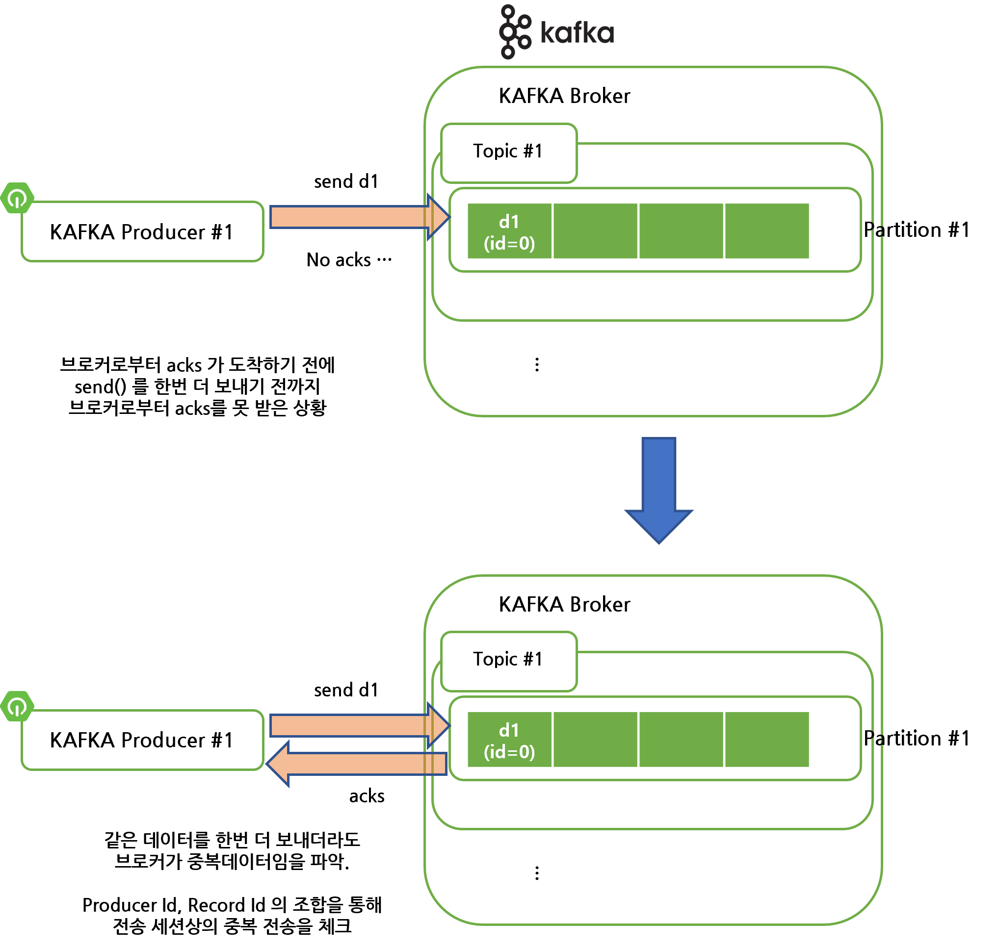
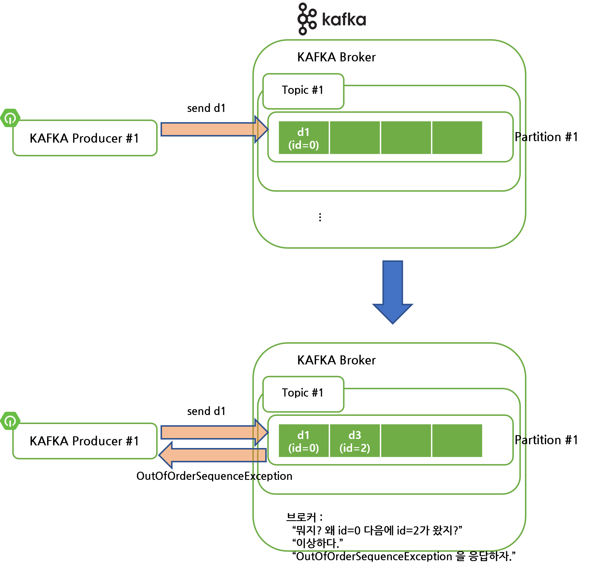

# 멱등성 프로듀서

### 멱등성

몇번을 수행하더라도 같은 결과를 내는 것을 의미

<br>


### 멱등성 프로듀서

같은 데이터를 여러번 전송해도 카프카 클러스터에는 중복 없이 한번만 저장되는 것을 의미.

<br>


### 카프카 프로듀서의 멱등성 옵션

카프카 프로듀서의 멱등성 디폴트 옵션은 ==적어도 한번 전달(at least once delivery)== 이다.

적어도 한번 전달 방식은 데이터가 중복되어 저장될 수 있다.

아래는 카프카 프로듀서가 지원하는 전송 옵션들이다.

- At least once : 적어도 한번 이상 전달
- At most once : 최대 한번 전달
- Exactly Once : 정확히 한번 전달

<br>


### 멱등성 프로듀서

데이터의 중복적재를 막기 위해 카프카 **0.11.0** 이후의 버전부터는 프로듀서에서 ==enable.idempotence== 옵션을 지원하기 시작했다. ==enable.idempotence== 옵션은 ==정확히 한번 전달(exactly once delivery)==을 지원하는 옵션이다. 멱등성 옵션의 정확한 의미는 데이터(이벤트)를 정확히 한번만 저장하겠다는 의미다. 만약 같은 데이터(이벤트)를 중복해서 보낼 경우 데이터(이벤트)를 추가하는 것이 아니라 수정을 하게 된다.

<br>


- enable.idempotence = false
  - 카프카 프로듀서의 기본값.(카프카 1.0.0 ~ 2.x)
  - 카프카 3.0.0 부터는 기본값이 아니다.
- enable.idempotence = true
  - 카프카 3.0.0 부터는 enable.idempotence = true 가 기본값.
  - true 로 설정하면 정확히 한번 전달(exactly once delivery) 방식으로 설정된다.
  - true 로 설정하면 프로듀서의 아래의 옵션들이 고정된다.
    - retries : Integer.MAX_VALUE
    - aks : all
    - 프로듀서가 적어도 한번 이상 브로커에 데이터를 보내서 브로커에 단 한번만 데이터가 저장되는 것을 보장되기 위해 retries = Integer.MAX_VALUE 로 설정한다. 이렇게 하면 여러번 보냈을 때 중복된다면, 데이터(이벤트)의 추가가 아닌 수정 작업을 수행하게 된다. 

<br>


코드에서는 아래와 같이 설정한다.

```java
Properties configs = new Properties();
configs.put(ProducerConfig.ENABLE_IDEMPOTENCE_CONFIG, true);
// ...

KafkaProducer<String, String> producer = new KafkaProducer<>(configs);
```

<br>


### 멱등성 프로듀서의 고유성 식별방식

==PID(Producer unique ID)==라고 하는 프로듀서 ID와 ==SID(Sequence ID)== 라는 레코드의 시퀀스 ID를 조합해 프로듀서가 보낸 데이터가 이것이 클러스터 내에서 고유한 데이터인지 고유성을 식별한다.

- PID (Producer Unique ID) : 프로듀서 ID
- SID (Sequence ID) : 레코드의 전달 번호 ID

<br>


예를 들어 멱등성 프로듀서로 설정하지 않은 경우, 카프카 프로듀서가 브로커에 전달한 데이터(이벤트)는 브로커 내에 중복되어 저장될 수 있다.



<br>


멱등성 프로듀서를 설정한 경우 아래 그림 처럼 카프카 프로듀서가 브로커에 전달한 데이터는 브로커 내에서 중복을 피해 저장된다.




<br>


### 멱등성 프로듀서의 한계

멱등성 프로듀서는 **동일 세션(네트워크 커넥션)에 대해서만 정확히 한번 전달을 보장**한다. 네트워크 커넥션이 끊기고 새로운 프로듀서가 생기거나, 기존 프로듀서가 같은 데이터를 보내면 멱등성 전송이 보장되지 않을 수도 있따. 예를 들어 프로듀서가 살아있는 상태에서 브로커와 연결되었을 때 PID 가 2 라고 해보자. 그런데 어떤 이유에서인지 프로듀서 하나가 없어졌다. 그래서 프로듀서를 하나 새로 띄웠는데, 이 프로듀서는 PID 를 10 으로 해서 기동되었다고 해보자.

이렇게 된다면 같은 데이터를 보내더라도 PID가 달라지기에 멱등성을 판단할 수 잇는 기준이 모호해져서 장애가 발생할 가능성이 생긴다.

<br>


### 멱등성 프로듀서 사용시 OutOfOrderSequenceException

멱등성 프로듀서는 시퀀스 넘버를 0부터 시작해서 1씩 더해나가면서 증가한다. 

멱등성 프로듀서가 전송한 데이터(이벤트)를 브로커가 PID, 시퀀스 번호로 분해했을 때 시퀀스 번호가 카프카 브로커 입장에서는 일정하지 않을때 OutOfOrderSequenceException 이 발생할 수 있다.

즉, 브로커가 예상하는 시퀀스 넘버와 다른 번호의 데이터(이벤트) 적재 요청이 발생했을 때 OutOfOrderSequenceException 이 발생한다.

<br>



