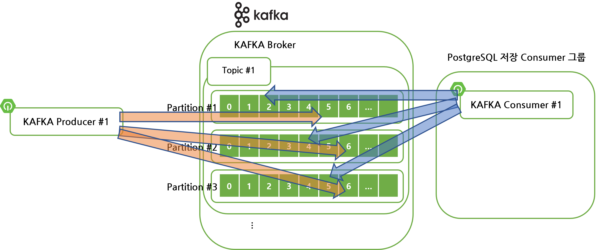

# 카프카 컨슈머

가급적 요약, 결론 성격의 주제들은 최대한 앞으로 두었다.

구체적인 내용을 의미하는 실제 구현, 컨슈머 옵션 등등은 뒤에 두었다.

다른 일을 하다가 카프카가 기억이 안날 때 최대한 요약이 된 부분을 위주로 읽으면서 스트레스를 완화하다가 구체적인 자료를 읽을 수 있도록 구성해봤다.

<br>


### 참고자료

- [developer.confluent.io - Consumer Group Protocol](https://developer.confluent.io/learn-kafka/architecture/consumer-group-protocol/)
- [아파치 카프카 애플리케이션 프로그래밍 - 개념부터 컨슈머, 프로듀서, 커넥트, 스트림즈까지](https://www.inflearn.com/course/%EC%95%84%ED%8C%8C%EC%B9%98-%EC%B9%B4%ED%94%84%EC%B9%B4-%EC%95%A0%ED%94%8C%EB%A6%AC%EC%BC%80%EC%9D%B4%EC%85%98-%ED%94%84%EB%A1%9C%EA%B7%B8%EB%9E%98%EB%B0%8D/dashboard)

<br>


### kafka-client 라이브러리

python, go, java 등 여러가지 언어에서는 kafka-client 라는 라이브러리를 지원한다. 우리가 보통 카프카 프로듀서, 카프카 컨슈머를 이야기하는 것은 프로그래밍 언어에서 kafka-client 를 이용해서 프로듀서 애플리케이션을 작성하면 카프카 프로듀서라고 이야기하고, kafka-client 를 이용해서 컨슈머 애플리케이션을 작성하면 카프카 컨슈머라고 이야기한다.

<br>


### 카프카 클러스터, 토픽, 파티션, 카프카 컨슈머, 컨슈머 그룹

#### 카프카 (브로커) 클러스터

카프카 클러스터는 여러개의 브로커를 묶어놓은 하나의 분산 시스템이다. 뭔가 거창한 단어로 표현했지만 쉽게 설명하면 서버 3개를 한 단위로 묶어놓은 클러스터링 개념을 적용한 브로커 시스템이다.

아래 그림에서는 제일 왼쪽에 위치한 Kafka 라고 표시된 사각형 영역이다.

<br>


#### 토픽, 파티션

브로커 하나 안에는 토픽이 존재한다. 토픽에는 파티션을 두어서 토픽 하나에 대한 처리를 여러개의 파티션으로 나눠서 분산 처리할 수 있게끔 파티션의 갯수를 조정할 수 있다. 아래 그림에서는 제일 왼쪽의 Kafka 라고 표시된 사각형 영역 안에 t1, t2가 보인다. 이 t1, t2 는 토픽들을 의미하고, 토픽 하나에 위치하고 있는 p0, p1 은 파티션이라고 부른다.

그림에서 보이듯 p0, p1 은 마치 큐처럼 생긴 자료구조다. 

<br>


#### 카프카 컨슈머 그룹, 카프카 컨슈머

kafka-client 라이브러리 내에는 KafkaConsumer 라고 하는 클래스가 있다. KafkaConsumer 라고 하는 클래스에서 제공해주는 여러 종류의 메서드를 이용해서 컨슈머 애플리케이션의 로직을 작성한다.

KafkaConsumer가 통신을 하는 제일 앞단은 내부적으로 Fetcher, LinkedQueue, ConsumerNetworkClient 를 이용해 지연처리, 비동기 I/O 기반의 네트워크 통신을 한다.

그림의 중앙을 보면 Consumer Group 이라고 표시된 영역이 보인다. Consumer 는 Group 단위로 묶을 수 있다.  보통 Consumer Group 은 같은 로직을 같는 컨슈머들을 컨슈머 그룹으로 묶는다.


> 그림 : [developer.confluent.io - Consumer Group Protocol](https://developer.confluent.io/learn-kafka/architecture/consumer-group-protocol/)

<br>


카프카에서는 카프카 컨슈머가 파티션을 직접 지정해서 subscribe() 할수 있는 경우도 있다. 하지만 이렇게 파티션 번호와 토픽 명을 구체적으로 명시해서 소비하는 경우는 흔하지 않은 경우다.

<br>


### 컨슈머 그룹을 묶는 기준

일반적으로 동일한 로직에 대한 컨슈머 인스턴스들을 하나로 컨슈머 그룹으로 묶는다. 

쉽게 설명하면 동일한 컨슈머 로직을 여러개의 컨슈머 인스턴스로 띄우고 이 인스턴스 들을 같은 컨슈머 그룹으로 묶는 것을 의미한다. 


<br>

위의 그림을 보면 PostgreSQL에 데이터를 Batch Upsert 하는 컨슈머들을 하나의 컨슈머 그룹으로 묶었고 WebSocket Push 를 하는 컨슈머들을 하나의 컨슈머 그룹으로 묶었다. 컨슈머 그룹은 위의 그림처럼 동일한 연산을 수행하는 컨슈머들을 하나의 컨슈머그룹으로 묶는다.

<br>

예제 코드는 아래와 같다.

e.g. 컨슈머 그룹 단위로 소비를 하고 비동기적으로 오프셋을 커밋하는 코드

```java
Logger logger = LoggerFactory.getLogger(ConsumerWithASyncCommit.class);
String TOPIC_NAME = "TOPIC111111";
String BOOTSTRAP_SERVERS = "localhost:9092";
String GROUP_ID = "commitASyncCallbackTestGroup";

Properties configs = new Properties();
// BOOTSTRAP_SERVERS 지정
configs.put(ConsumerConfig.BOOTSTRAP_SERVERS_CONFIG, BOOTSTRAP_SERVERS);
// Group Id 지정
configs.put(ConsumerConfig.GROUP_ID_CONFIG, GROUP_ID);

// Key, Value Deserializer 각각 지정
configs.put(ConsumerConfig.KEY_DESERIALIZER_CLASS_CONFIG, StringDeserializer.class.getName());
configs.put(ConsumerConfig.VALUE_DESERIALIZER_CLASS_CONFIG, StringDeserializer.class.getName());


// ENABLE_AUTO_COMMIT_CONFIG 를 false 로 지정
configs.put(ConsumerConfig.ENABLE_AUTO_COMMIT_CONFIG, false); 

while(true){
    ConsumerRecords<String, String> records = consumer.poll(Duration.ofSeconds(1));
    
    for(ConsumerRecords<String, String> record: records){
        // 각각의 record 에 대한 비즈니스 로직... 
    }
    
    // 카프카에 offset 을 커밋한다.
    // callback 내에서 어떤 offset 에서 실패했는지를 확인 가능하다.
    consumer.commitAsync(new OffsetCommitCallback(){ // 비동기적으로 커밋하고 후처리를 위해 콜백을 정의
       public void onComplete(Map<TopicPartion, OffsetAndMetadata> offsets, Exception e){
           if(e != null) System.err.println("Commit failed");
           else System.out.println("Commit succeeded");
           if(e != null) logger.error("Commit failed for offsets {}", offsets, e);
       } 
    });
}
```

<br>


### 파티션의 갯수와 컨슈머 그룹 내의 컨슈머의 갯수 지정

#### 컨슈머 그룹의 컨슈머 갯수와 토픽 내의 파티션 갯수를 맞춰놓은 경우

컨슈머 그룹의 컨슈머 갯수는 되도록이면 토픽 내의 파티션 갯수와 맞춰야 효율적이다. 이론 적으로는 컨슈머 그룹에 컨슈머의 갯수를 파티션 갯수만큼 두는 것이 성능적인 측면에서는 이득이다. 컨슈머 각각에 파티션의 이벤트가 분배되기 때문이다.


<br>

#### 컨슈머 그룹의 컨슈머 갯수가 파티션 갯수보다 적은 경우

아래 그림처럼 컨슈머 그룹내의 컨슈머 갯수가 파티션 갯수보다 적으면, 특정 컨슈머에 파티션의 데이터가 몰릴 수 있다. 따라서 특정 컨슈머만 요청을 많이 처리하게 될 수 있다. 되도록이면 컨슈머 갯수를 파티션 갯수와 맞춰야 부하가 균등하게 몰리는데, 아래 그림과 같은 구조는 특정 컨슈머에 부하가 몰릴수도 있는 구조다.


<br>


#### 컨슈머 그룹의 컨슈머 갯수가 파티션 갯수보다 많은 경우

아래 그림처럼 컨슈머의 갯수가 파티션 갯수보다 많으면, 놀고 있는 컨슈머가 생긴다. 아래 그림에서는 **'Kafka Consumer #4'**가 유휴 인스턴스가 된다. 만약 인스턴스 설계시 트래픽이 꽤 크다고 판단되어 어느 정도 중형 규모의 컨슈머들을 머신으로 각각 여러개 띄운 경우라면 아래 구조는 비용상으로 낭비가 심한 구조가 될 수도 있다.


<br>


### 카프카 컨슈머 그룹의 리밸런싱

#### 리밸런싱이란?

컨슈머 그룹에 컨슈머가 하나 더 추가되거나 삭제되었을 때 

파티션의 이벤트를 누락없이 소모할 수 있도록 기존의 컨슈머들의 이벤트 소비를 재배치하는 것을 의미한다.

컨슈머 그룹 내에서 컨슈머가 물리적인 장애가 발생할 수도 있고, 네트워크 장애가 발생할수도 여러가지 상황이 있을 수 있다.

이렇게 컨슈머 그룹 내의 컨슈머 갯수에 변동이 발생했을 때 이벤트 소비 방식을 재배치하는 것을 '리밸런싱'이라고 한다.


위의 그림을 보면 Consumer #3 에 장애가 발생했다. 카프카 컨슈머 그룹은 특정 컨슈머가 장애가 발생해서 지연이 발생하는 것을 파악해 Consumer #3 에 Partition #3 가 할당되어 구독하던 것을 Consumer #2 가 구독하도록 파티션을 재배치 해줬는데, 이런 과정을 **리밸런싱** 이라고 부른다.

<br>


#### 리밸런싱은 장애에 가까운 상황이다.

리밸런싱 시에 리밸런싱에 소모되는 시간은 매우 짧은 편이다.

하지만, 특정 경우에는 리밸런싱 시에 소모되는 시간이 꽤 길어질 수 있다. 예를 들어 토픽 내에 파티션을 1000개 이상을 잡아놓는 경우가 그런 경우다.

따라서 리밸런싱이 자주 발생하지 않도록 컨슈머 로직에 장애가 나지 않도록 로직을 잘 작성하는 것이 좋지만, 리밸런싱이 발생할 수 있는 경우에 대한 로직도 잘 작성하는 것도 중요하다.

장애가 발생하지 않으리라는 보장은 없기 때문에 리밸런싱 시에 대응하는 로직을 잘 작성해야 한다.<br>

<Br>


### 리밸런스 리스너 (별도 문서 정리)

<br>


### 커밋

#### 커밋이란??


컨슈머는 브로커에서 가져온 데이터를 어디까지 읽었는지를 commit 을 통해 기록한다.

컨슈머가 commit 을 하면 카프카 브로커 내부 토픽인 `__consumer_offsets` 토픽에 어느 레코드까지 읽어갔는지 기록한다. (특정 토픽의 파티션을 어떤 컨슈머가 몇번째까지 가져갔는지를 기록한다.)

<br>


#### 오프셋 중복 커밋 관련 이슈

그런데 컨슈머에 장애가 나는 등의 상황이 발생해서 `__consumer_offsets` 토픽에 오프셋 커밋이 정상적으로 수행되지 않아서, 특정 오프셋을 커밋 안된 데이터로 인식되어 데이터 처리를 중복으로 처리하게 되는 이슈가 발생할 수 있다.

주로 리밸런싱, 컨슈머 강제 종료 시에 장애로 여겨질 만한 상황이 발생한다. 컨슈머를 컨슈머 그룹에서 운영할 때 주로 리밸런스 이슈가 발생하는데, 트래픽이 많아질 수록 컨슈머 그룹을 사용하지 않을 수는 없다.

이렇게 메시지 중복 소비 등이 발생할 수도 있는 상황은 설정을 통해 이슈를 해결 할 수도 있고, 오프셋 커밋을 정상적으로 처리했는지 검증하는 로직을 통해서 해결할 수도 있다. 여기에 대해서는 별도의 문서에 정리해두었다.

<br>


#### 컨슈머 메시지 중복 소비 관련 이슈 해결 사례들 (별도 문서 정리 예정)

<br>

<br>


### 컨슈머 랙

#### 컨슈머 랙이란??

아래 그림에서는 프로듀서가 발행하고 있는 최신 위치는 5다. 그리고 컨슈머가 현재 1까지는 처리를 완료했고, 2에 접근해서 데이터를 처리하려고 하고 있다. 이렇게 **프로듀서가 이벤트(데이터)를 발급하는 속도를 컨슈머가 따라가지 못해서 생기는 간격을 컨슈머 랙** 이라고 부른다. **컨슈머 랙은 컨슈머 그룹, 토픽, 파티션 별로 생성**된다.


<br>


아래 그림의 경우 컨슈머 랙은 3개이다. 개발환경에서 컨슈머를 1개만 띄워서 컨슈머 1기가 파티션 3개를 모두 구독하도록 지정해줬다. 아래 경우는 컨슈머를 1기만 띄웠다고 해도 실질적으로 셀수 있는 컨슈머 랙은 3개이기에 컨슈머 랙은 3 이다.



<br>


#### 프로듀서의 이벤트 발급속도, 컨슈머의 이벤트 처리 속도

보통 프로듀서의 이벤트 발급속도는 빠르지만 컨슈머의 이벤트 처리속도가 이 것을 따라가지 못하는 경우가 많다. 이벤트라는 것은 소켓 메시지라고 생각할 수 있는데, 프로듀서의 경우 토픽에 메시지를 단건으로 보내든 배치단위로 보내든, 중간에 부가적인 처리 없이 단순 전송만을 하기 때문에 이벤트 발급 속도가 저하될 이유는 크지 않다. 

물론, 프로듀서 역시 트래픽이 몰릴 경우 이것을 비동기 처리를 해야 하는데, 비동기 스레드 풀을 잘 설계할지, 쿠버네티스와 같은 애플리케이션 클러스터를 구축할지를 선택해야 한다. 단순히 @Async 어노테이션 달랑 붙여놓는 걸로 때우고 될거라고 생각하면 당연하게도 중대형 트래픽 처리시에는 나중에 해결이 안되는 경우가 많다.

문제는 컨슈머다. 컨슈머측에서는 보통 IO를 처리해야 하는 경우가 비일 비재하다. 예를 들어 database에 어떤 값을 저장하고 웹소켓으로도 해당 메시지를 보내줘야 하고, 하둡에도 어떤 데이터를 저장하는 등 IO 처리가 꽤 자주 일어난다. 

따라서 컨슈머의 이벤트 처리속도가 프로듀서의 이벤트 발급 속도를 따라잡지 못하고 컨슈머 랙이 점점 커지는 경우가 생길 수 있다.

주로 발생하는 컨슈머 랙이 발생할 때의 모습은 아래와 같다.

컨슈머가 주로 담당하는 물리적인 IO의 처리속도가 프로듀서의 이벤트 발급속도를 따라가지 못하는 것은 이론상으로 당연한 현상이다.


<br>


프로듀서의 이벤트 발급 속도에 맞춰서 컨슈머의 물리적인 IO 발급속도가 이것을 따라가는 경우는 아래와 같다. 주로 테스트 환경, 로컬 개발PC 에서는 이렇게 컨슈머가 처리를 빠르게 수행하는 것처럼 보인다.


<br>


#### 컨슈머 랙의 2가지 종류

- 프로듀서가 발급하는 이벤트 양 증가해서 생기는 컨슈머 랙 
  - 새로 유입되는 이벤트 양이 급격히 증가할 경우다. 이 경우 이벤트의 생산속도를 기존 소비자가 못따라간다.
  - 파티션의 갯수와 컨슈머의 갯수를 늘려서 병렬 처리량을 늘릴린다.
- 특정 컨슈머에 장애가 발생해서 생기는 컨슈머 랙
  - 이 경우 특정 컨슈머가 소유한 특정 파티션에서만 컨슈머 랙이 발생하게 된다.

<br>


##### 프로듀서가 발급하는 이벤트 양이 증가해서 생기는 컨슈머 랙

이렇게 이벤트의 양이 급증하는 경우 토픽을 파티셔닝해서 토픽의 파티션 갯수를 늘리고 여기에 맞춰 컨슈머도 늘리는 방법이 하나의 방법이 될 수 있다.

주로 개발 초창기 개발 완료 직후 트래픽이 완만하게 증가하는 경우가 여기에 해당될것 같다.


<br>


##### 특정 컨슈머에 장애가 발생해서 생기는 컨슈머 랙

파티셔닝을 아무리 잘 해두었더라도 이제는 더 이상 파티셔닝을 늘릴 수 없을때가 있다. 또는 파티셔닝을 늘리고 컨슈머를 늘려도 더 이상은 토픽을 분할하는 효과를 볼수 없을 경우가 있다. 

결국은 컨슈머가 IO 처리를 따라가지 못하거나, 컨슈머 자체의 인스턴스에 물리적인 장애가 발생해서 컨슈머 랙이 발생해서 프로듀서의 이벤트(데이터)발급속도에 비해 컨슈머가 데이터 처리를 못따라가는 경우가 결국은 발생한다.


<br>

장애는 어떻게든 생길수밖에 없다. 만약 컨슈머가 받은 데이터를 독자적인 애플리케이션 인스턴스로 처리자(worker)를 따로 구현해둔 경우, 컨슈머 랙이 큰 부분에 대해 처리량을 늘릴수 있도록 인스턴스의 갯수를 늘리는 등 컴퓨팅 자원을 늘리는 처리를 해서 대응할수 있다.<br>

따라서 컨슈머의 데이터를 받는 worker 애플리케이션의 분산처리가 중요하고, 어떤 컨슈머의 처리가 느려지는 상황이며 준 장애에 해당되는지 모니터링 할 수 있는 **컨슈머 랙 모니터링**이 중요하다.

<br>


### 컨슈머 랙 모니터링

#### 컨슈머 랙을 모니터링 하는 방법들

컨슈머 랙을 모니터링 하는 방법은 3가지가 있다.

- 카프카 CLI 사용 (kafka-consumer-groups.sh 를 사용)
  - 급하게 머신에 접속해서 확인해야 하는 경우 직관적인 해결방식이다.
  - 하지만, 업무시간 외에 일반적으로 일상생활 도중에도 확인이 가능하려면 이렇게 CLI 에 수작업으로 접속해서 모니터링하는 것은 비효율적이다.
- KafkaConsumer 인스턴스의 metrics() 메서드를 통한 컨슈머 랙 지표 데이터 사용
  - records-lag-max, records-lag, records-lag-avg
  - 컨슈머가 정상적으로 동작할 때만 확인이 가능하다는 단점이 있다.
- 외부 모니터링 툴 사용
  - e.g. 데이터독(Datadog), 컨플루언트 컨트롤센터(Confluent Control Center), 버로우(Burrow)

<br>


#### 버로우

버로우(Burrow)는 링크드인에서 개발해서 오픈소스로 공개한 컨슈머 랙 체크 툴이다.

REST API 로 컨슈머 그룹별로 컨슈머 랙을 확인할 수 있다.

버로우는 여러개의 카프카 클러스터에 동시에 연결해서 컨슈머 랙을 확인할 수 있다. 다만, 컨슈머 랙만 확인할 수 있다. 

이 외의 여러가지 정보들 (클러스터에 연결된 모든 컨슈머, 토픽들의 랙 정보들)을 모니터링해야 한다면 데이터독(Datadog), 컨플루언트 컨트롤센터(Confluent Control Center) 를 사용해보자. 다만 유료라는 점을 기억하자.


#### 별도 문서에 정리

컨슈머 랙 모니터링, 버로우에 대한 내용은 별도의 문서에 정리해둘 예정이다.


### 컨슈머의 주요 옵션 

#### 필수 옵션

- bootstrap.servers
- key.deserializer
- value.deserializer


#### optional 한 옵션

- group.id
  - 컨슈머 그룹 id 
  - subscribe() 로 토픽 구독시에는 이 옵션이 필수다.
- **auto.offset.reset**
  - 이미 컨슈머 오프셋이 있다면 이 옵션은 무시된다.
  - 컨슈머 그룹이 특정 파티션을 읽을때 이미 저장된 오프셋 정보가 없을 경우 오프셋을 어느 위치에서부터 읽어들일지 결정하는 옵션이다. 기본 값은 `latest` 다.
  - latset : 가장 최근(높은) 오프셋부터 읽기 시작
  - earlist : 가장 오래 전(낮은) 오프셋부터 읽기 시작
  - none : 커밋한 기록이 있는지 찾아보고 커밋 기록이 없으면 오류 리턴, 커밋 기록이 있으면 커밋기록 이후의 오프셋부터 읽어들이기 시작. 
- enable.auto.commit
  - 자동 커밋, 수동 커밋 둘중 하나를 선택하는 옵션
  - 기본 값은 true 다. (auto commit = true)
- auto.commit.interval.ms
  - 자동 커밋일 경우 오프셋 간격을 지정한다.
  - 기본값 : 5000 (ms)
- max.poll.records
  - poll() 메서드로 반환하는 레코드 갯수를 지정한다.
  - 기본값 : 500
- session.timeout.ms
  - 컨슈머와 브로커가 연결이 끊지는 최대 시간
  - 기본값: 10000(ms), 10초
- hearbeat.interval.ms
  - 하트비트를 전송하는 시간 간격
  - 기본값 : 3000(ms), 3초
- max.poll.interval.ms
  - poll() 메서드를 호출하는 간격의 최대 시간
  - 기본값 : 300000(ms), 5분
- isolation.level
  - 트랜잭션 프로듀서가 레코드를 트랜잭션 단위로 보낼 경우 사용한다.

<br>


#### auto.offset.reset

위에서 정리한 옵션이다. 교재를 보면 중요한 옵션인지 따로 챕터로 빼서 정리되어 있다.

이미 저장된 컨슈머 오프셋이 없을 경우 오프셋을 어디부터 읽을지 선택하는 옵션

기본 값은 latest다.

- latest
- earliest
- none

<br>


### 컨슈머를 구성하는 방식 - 멀티스레드 vs 멀티프로세스

컨슈머 스레드의 갯수는 파티션 갯수와 동일하게 맞추면 좋다.

여러 개의 컨슈머 스레드를 여러개의 프로세스를 띄워서 프로세스 하나에 스레드 하나씩을 띄우는 **멀티프로세스 방식**이 있고 여러개의 컨슈머 스레드를 하나의 프로세스에 띄우는 **멀티 스레드 방식**이 있다.

<br>

**멀티프로세스 방식**

- 여러개의 컨슈머 스레드를 프로세스 하나에 하나의 스레드를 띄우는 식으로 배포하는 멀티프로세스 방식
- 프로세스 하나에 컨슈머 스레드 하나를 할당해서 각각의 스레드가 다른 스레드와 독립된 환경에서 격리되어 실행되게끔 하기에 장애에 조금은 안전하고, 하나의 스레드가 다른 스레드의 작업에 방해를 하지 않기에 다소 안전한 방식이다.
- 프로세스별로 띄우기에 배포하는 방식을 잘 지정해야 한다.
- 예를 들면 쿠버네티스 등과 같은 애플리케이션 클러스터링을 수행하거나 배포 스크립트를 통해 각각을 독립된 프로세스에 띄우거나, 모놀리딕 기반의 애플리케이션 클러스터링을 하는 경우를 예로 들 수 있다.

<br>

**멀티 스레드 방식**

- 여러개의 컨슈머 스레드를 하나의 프로세스 안에서 띄우는 방식
- 컨슈머를 구동하는 머신이 스케일 업 방식의 고사양 머신일 경우다.
- 흔치 않은 경우인데, 초기에 이렇게 구성을 하고 빠르게 배포방식을 전환하지 않는다면 비용적인 측면에서 이것을 해결할 방법을 찾기 쉽지 않다.
- 멀티스레드 프로그래밍은 어렵다. 병목현상이 어디에서 발생하는 지도 알기 쉽지 않다. 변수도 많다. 
- 주로 개발 초창기에 개발된 내용을 여러개의 인스턴스로 띄울 필요가 없는 경우에 채택하는 방식이다.

<br>


### 어사이너(assignor)

컨슈머를 어떤 파티션에게 할당할 지를 결정하는 역할을 하는 카프카의 기능.

카프카에서는 RangeAssigner, RoundRobinAssignor, StickyAssignor 를 제공하고 있고, 카프카 2.5.0 에서는 RangeAssignor 가 기본설정이다.

일반적으로는 파티션 갯수와 컨슈머의 갯수를 동일하게 맞춰서 운영하기에 Assignor 를 크게 고민하는 경우는 많지 않다.

- RangeAssignor 
  - 각 토픽 내에서 파티션을 숫자로 정렬하고, 컨슈머를 사전 순으로 정렬해서 할당
- RoundRobinAssignor
  - 모든 파티션을 컨슈머에게 번갈아가면서 할당
- StickyAssignor
  - 파티션을 균등하게 배분하면서 할당

<br>


### 컨슈머 애플리케이션 만들어보기

#### build.gradle

```groovy
plugins{
    id 'java'
}

group 'com.example'
version '1.0'
repositories { mavenCentral() }

dependencies {
    compile 'org.apache.kafka:kafka-clients:2.5.0'	 // kafka-clients
    compile 'org.slf4j:slf4j-simple:1.7.30'
}
```

<br>


#### 단순 컨슈머 만들어보기 (subscribe() 사용)

```java
public class SimpleConsumer{
    private final static Logger logger = LoggerFactory.getLogger(SimpleConsumer.class);
    
    private final static String TEST_TOPIC_1 = "TEST_TOPIC_1";
    
    public static void main(String [] args){
        Properties configs = new Properties(); // apache kafka 관련 패키지의 Properties 클래스
        configs.put(ConsumerConfig.BOOTSTRAP_SERVER_CONFIG, "{서버주소}:9092");
        configs.put(ConsumerConfig.GROUP_ID_CONFIG, "{컨슈머그룹아이디}");
        configs.put(ConsumerConfig.KEY_DESERIALIZER_CLASS_CONFIG, StringDeserializer.class.getName());
        configs.put(ConsumerConfig.VALUE_DESERIALIZER_CLASS_CONFIG,                 StringDeserializer.class.getName());
        
        KafkaConsumer<String, String> consumer = new KafkaConsumer<>(configs);
        consumer.subscribe(Arrays.asList(TEST_TOPIC_1));
        
        // ...
        
    }
}
```

<br>


#### 단순 컨슈머 만들어보기 (poll() 사용)

```java
public class SimpleConsumer{
    private final static Logger logger = LoggerFactory.getLogger(SimpleConsumer.class);
    private final static String TEST_TOPIC_1 = "TEST_TOPIC_1";
    
    public static void main(String [] args){
        // ...
        
        while(true){
            ConsumerRecords<String, String> records = consumer.poll(Duration.ofSeconds(1));
            for(ConsumerRecord<String, String> record: records){
                // 각각의 레코드에 대한 비즈니스로직 수행 ... 
                logger.info("record : {}", record);
            }
        }
    }
}
```

<br>


### 수동 커밋 컨슈머 애플리케이션

#### 동기 방식

- 동기방식이기에 자주 쓰이는 방식은 아닐 듯 하다.


##### commitSync() 방식 소비 (Records 단위 커밋 컨슈머)

동기방식 으로 commit 을 수행하는 방식이다. 오프셋의 커밋을 동기방식으로 진행한다.

poll() 로 받아온 데이터의 가장 맨 끝의 레코드에 대한 offset을 커밋한다.

따라서 poll() 로 받은 ConsumerRecords\<String, String\> 의 가장 마지막까지 소비했다는 것이 확실한 지점에서 commit 하게끔 로직을 작성하게 된다.

동기방식이기에 자주 쓰이는 방식은 아닐 듯 하다.

```java
String TOPIC_NAME = "topic111";
String BOOTSTRAP_SERVERS = "localhost:9092";
String GROUP_ID = "commitSyncNoCallbackTestGroup";

Properties configs = new Properties();
configs.put(ConsumerConfig.BOOTSTRAP_SERVERS_CONFIG, BOOTSTRAP_SERVERS);
configs.put(ConsumerConfig.GROUP_ID_CONFIG, GROUP_ID);
configs.put(ConsumerConfig.KEY_DESERIALIZER_CLASS_CONFIG, StringDeserializer.class.getName());
configs.put(ConsumerConfig.VALUE_DESERIALIZER_CLASS_CONFIG, StringDeserializer.class.getName());
configs.put(ConsumerConfig.ENABLE_AUTO_COMMIT_CONFIG, false); // 자동 커밋을 false 로 지정

KafkaConsumer<String, String> consumer = new KafkaConsumer<>(configs);
consumer.subscribe(Arrays.asList(TOPIC_NAME));

while(true){
    ConsumerRecords<String, String> records = consumer.poll(Duration.ofSeconds(1));
    for(ConsumerRecord<String, String> record: records){
        // 각각의 레코드에 대한 비즈니스로직 수행 ... 
        logger.info("record : {} ", record);
    }
    consumer.commitSync(); // ConsumerRecords<String, String> 의 가장 마지막 오프셋 소비를 완료했다는 것이 확실시 되는 지점이다.
}
```

<br>


##### commitSync(currentOffset) 방식 소비 (Record 단위 커밋 컨슈머)

각각 개별 Record 에 대한 offset 정보들을 기반으로 커밋한다.

이렇게 개별 Record 에 대한 offset 에는 소속 토픽, 파티션, 오프셋에 대한 정보를 가지고 있기에 다음번 오프셋은 어느 위치로 할 지 등을 직접 코드 상으로 지정이 가능하다.

동기방식이기에 자주 쓰이는 방식은 아닐 듯 하다.

```java
KafkaConsumer<String, String> consumer = new KafkaConsumer<>(configs);
consumer.subscribe(Arrays.asList(TOPIC_NAME));

while(true){
    ConsumerRecords<String, String> records = consumer.poll(Duration.ofSeconds(1));
    Map<TopicPartition, OffsetAndMetadata> currentOffset = new HashMap<>();
    
    for(ConsumerRecord<String, String> record: records){
        // 각각의 레코드에 대한 비즈니스로직 수행 ... 
        logger.info("record : {} ", record);
        
        // 오프셋 정보 처리
        currentOffset.put(
            new TopicPartition(record.topic(), record.partition()),
            new OffsetAndMetadata(record.offset() + 1, null) // 오프셋을 지정해주고 있다.
        );
        
        // 동기(Sync) 방식 오프셋 커밋
        consumer.commitSync(currentOffset);
    }
}
```

<br>


#### 비동기 방식

동기방식에 비해 비동기방식으로 오프셋을 커밋하는 것이 일반적으로 권장되는 편이다.


##### 콜백 없는 방식의 오프셋 비동기 커밋, commitAsync() 

콜백을 지정하지 않고 비동기 방식으로 오프셋을 커밋을 하는 방식이다.

Records 를 모두 소모한 후에 비동기 방식으로 커밋한다.

```java
KafkaConsumer<String, String> consumer = new KafkaConsumer<>(configs);
consumer.subscribe(Arrays.asList(TOPIC_NAME));

while(true){
    ConsumerRecords<String, String> records = consumer.poll(Duration.ofSeconds(1));
    for(ConsumerRecord<String, String> record: records){
        // 각각의 레코드에 대한 비즈니스로직 수행 ... 
        logger.info("record : {}", record);
    }
    consumer.commitAsync(); // 비동기적으로 커밋 수행
    						// 콜백을 정의하지 않았기에 commit()을 비동기 스레드 풀에서 실행하는 것 까지만 진행됨.
}
```

<br>


##### 콜백 방식의 오프셋 비동기 커밋, commitAsync()

```java
Logger logger = LoggerFactory.getLogger(ConsumerWithASyncCommit.class);
String TOPIC_NAME = "TOPIC111111";
String BOOTSTRAP_SERVERS = "localhost:9092";
String GROUP_ID = "commitASyncCallbackTestGroup";

Properties configs = new Properties();
configs.put(ConsumerConfig.BOOTSTRAP_SERVERS_CONFIG, BOOTSTRAP_SERVERS);
configs.put(ConsumerConfig.GROUP_ID_CONFIG, GROUP_ID);
configs.put(ConsumerConfig.KEY_DESERIALIZER_CLASS_CONFIG, StringDeserializer.class.getName());
configs.put(ConsumerConfig.VALUE_DESERIALIZER_CLASS_CONFIG, StringDeserializer.class.getName());
configs.put(ConsumerConfig.ENABLE_AUTO_COMMIT_CONFIG, false); // ENABLE_AUTO_COMMIT_CONFIG 를 false 로 지정

while(true){
    ConsumerRecords<String, String> records = consumer.poll(Duration.ofSeconds(1));
    
    for(ConsumerRecords<String, String> record: records){
        // 각각의 레코드에 대한 비즈니스로직 수행 ... 
        logger.info("record : {} ", record);
    }
    
    // callback 내에서 어떤 offset 에서 실패했는지를 확인 가능하다.
    consumer.commitAsync(new OffsetCommitCallback(){ // 비동기적으로 커밋하고 후처리를 위해 콜백을 정의
       public void onComplete(Map<TopicPartion, OffsetAndMetadata> offsets, Exception e){
           if(e != null) System.err.println("Commit failed");
           else System.out.println("Commit succeeded");
           if(e != null) logger.error("Commit failed for offsets {}", offsets, e);
       } 
    });
}
```

<br>


#### 자동커밋 컨슈머 애플리케이션

```java
// ...

public class AutoCommitConsumer {
    private final static Logger logger = LoggerFactory.getLogger(ConsumerWithAutoCommit.class);
    private final static String TOPIC_NAME = "auto-commit-test";
    private final static String BOOTSTRAP_SERVERS = "localhost:9092";
    private final static String GROUP_ID = "test-group1";

    public static void main(String[] args) {
        Properties configs = new Properties();
        configs.put(ConsumerConfig.BOOTSTRAP_SERVERS_CONFIG, BOOTSTRAP_SERVERS);
        configs.put(ConsumerConfig.GROUP_ID_CONFIG, GROUP_ID);
        configs.put(ConsumerConfig.KEY_DESERIALIZER_CLASS_CONFIG, StringDeserializer.class.getName());
        configs.put(ConsumerConfig.VALUE_DESERIALIZER_CLASS_CONFIG, StringDeserializer.class.getName());
        
        // auto commit 을 true 로 세팅했다.
        configs.put(ConsumerConfig.ENABLE_AUTO_COMMIT_CONFIG, true); 
        configs.put(ConsumerConfig.AUTO_COMMIT_INTERVAL_MS_CONFIG, 60000);

        KafkaConsumer<String, String> consumer = new KafkaConsumer<>(configs);
        consumer.subscribe(Arrays.asList(TOPIC_NAME));

        while (true) {
            ConsumerRecords<String, String> records = consumer.poll(Duration.ofSeconds(1));
            for (ConsumerRecord<String, String> record : records) {
                // 각각의 레코드에 대한 비즈니스로직 수행 ... 
                logger.info("record:{}", record);
            }
            
            // 자동 커밋이기에 커밋 로직을 작성하지 않았다.
        }
    }
}
```

<br>


### 리밸런스 리스너 기반의 컨슈머 애플리케이션

리밸런스로 인해 컨슈머에게 파티션 할당을 완료한 시점, 또는 리밸런스를 시작하기 직전의 시점에 대한 리스너를 사용하는 것이 가능하다. kafka-client 에서는 이 기능과 관련해서 ConsumerRebalanceListener 인터페이스를 제공해주고 있다.

리밸런스 시작 전 마지막으로 처리된 레코드를 기준으로 커밋되도록 하려면 리밸런스를 시작하기 직전에 커밋하게끔 해주면 된다. 즉 onPartitionRevoked(Collection) 을 사용하면 된다. 

```java
public class RebalanceListener implements ConsumerRebalanceListener{
    private final static Logger logger = LoggerFactory.getLogger(RebalanceListener.class);
    
    public void onPartitionsAssigned(Collection<TopicPartition> partitions){
        logger.warn("Partitions are assigned");
    }
    
    public void onPartitionrevoked(Collection<TopicPartition> partitions){
        logger.warn("Partitions are revoked");
    }
}
```


- onPartitionAssigned() 
  - 리밸런스로 인해 파티션 할당이 이루어질때, 파티션 할당이 완료 후에 호출된다.
- onPartitionRevoked()
  - 리밸런스가 시작되기 직전에 호출되는 메서드다.

<br>


### 파티션 할당 컨슈머 애플리케이션

**자주 사용하는 방식이 아니다. 파티션을 직접 지정해서 소모하기 때문이다.**<br>

특정 컨슈머 로직에서 poll() 메서드를 통해 직접 파티션 번호와 토픽명을 지정해서 소비하는 경우다.

즉, 파티션을 직접 할당해서 소비하는 것을 의미한다.

> e.g. KafkaConsumer.consumer.assign(Collection)


특정 파티션을 지정하는 경우는 그렇게 흔치 않다.

주로 subscribe() 와 groupId 를 기준으로 처리한다.

```java
package com.example;

import org.apache.kafka.clients.consumer.*;
import org.apache.kafka.common.TopicPartition;
import org.apache.kafka.common.serialization.StringDeserializer;
// ...

public class ConsumerWithExactPartition {
    private final static Logger logger = LoggerFactory.getLogger(ConsumerWithExactPartition.class);
    private final static String TOPIC_NAME = "test";
    private final static int PARTITION_NUMBER  = 0;
    private final static String BOOTSTRAP_SERVERS = "my-kafka:9092";

    public static void main(String[] args) {
        Properties configs = new Properties();
        configs.put(ConsumerConfig.BOOTSTRAP_SERVERS_CONFIG, BOOTSTRAP_SERVERS);
        configs.put(ConsumerConfig.KEY_DESERIALIZER_CLASS_CONFIG, StringDeserializer.class.getName());
        configs.put(ConsumerConfig.VALUE_DESERIALIZER_CLASS_CONFIG, StringDeserializer.class.getName());

        KafkaConsumer<String, String> consumer = new KafkaConsumer<>(configs);
        
        // consumer.assign(Collection) 을 통해 토픽을 특정 컨슈머에 직접 지정하고 할당했다.
        consumer.assign(Collections.singleton(new TopicPartition(TOPIC_NAME, PARTITION_NUMBER)));
        
        while (true) {
            ConsumerRecords<String, String> records = consumer.poll(Duration.ofSeconds(1));
            for (ConsumerRecord<String, String> record : records) {
                // 각각의 레코드에 대한 비즈니스로직 수행 ... 
                logger.info("record:{}", record);
            }
        }
    }
}
```

<br>


### 컨슈머 애플리케이션의 안전한 종료

컨슈머 종료시에 안전하게 종료되도록 하려면 consumer.wakeup() 메서드를 명시적으로 호출해주면 좋다.

이렇게하면 consumer.wakeup() 메서드가 호출되면, poll() 메서드로 이벤트를 소비하려고 시도할 때 poll() 메서드 내에서는 WakeupException 이 발생해서 추가적인 이벤트 소비를 방지한다.

예를 들면 아래와 같이 구현가능하다.

```java
public class SomeApp{
    static class ShutdownThread extends Thread {
        public void run() {
            logger.info("Shutdown hook");
            consumer.wakeup();
        }
    }

    public static void main(String[] args) {
        // Runtime 의 shutdown hook 에서 consumer 를 wakeup 하도록 스레드를 등록해줬다.
        Runtime.getRuntime().addShutdownHook(new ShutdownThread());

        Properties configs = new Properties();
		// ...
        configs.put(ConsumerConfig.ENABLE_AUTO_COMMIT_CONFIG, false);

        consumer = new KafkaConsumer<>(configs);
        consumer.subscribe(Arrays.asList(TOPIC_NAME));

        try {
            while (true) {
                ConsumerRecords<String, String> records = consumer.poll(Duration.ofSeconds(1));
                for (ConsumerRecord<String, String> record : records) {
                    // 각각의 레코드에 대한 비즈니스로직 수행 ... 
                    logger.info("{}", record);
                }
                
                // 커밋
                consumer.commitSync();
            }
        } catch (WakeupException e) {
            logger.warn("Wakeup consumer");
        } finally {
            logger.warn("Consumer close");
            consumer.close();
        }
    }

}
```

<br>


