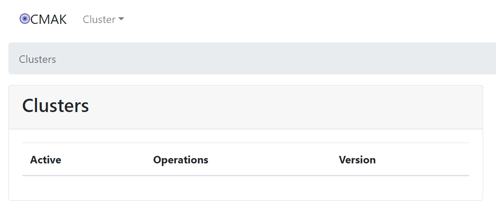
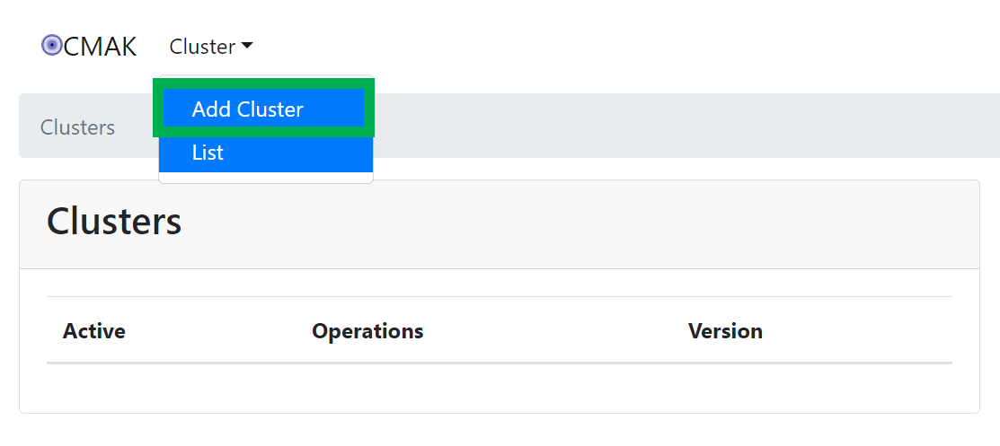
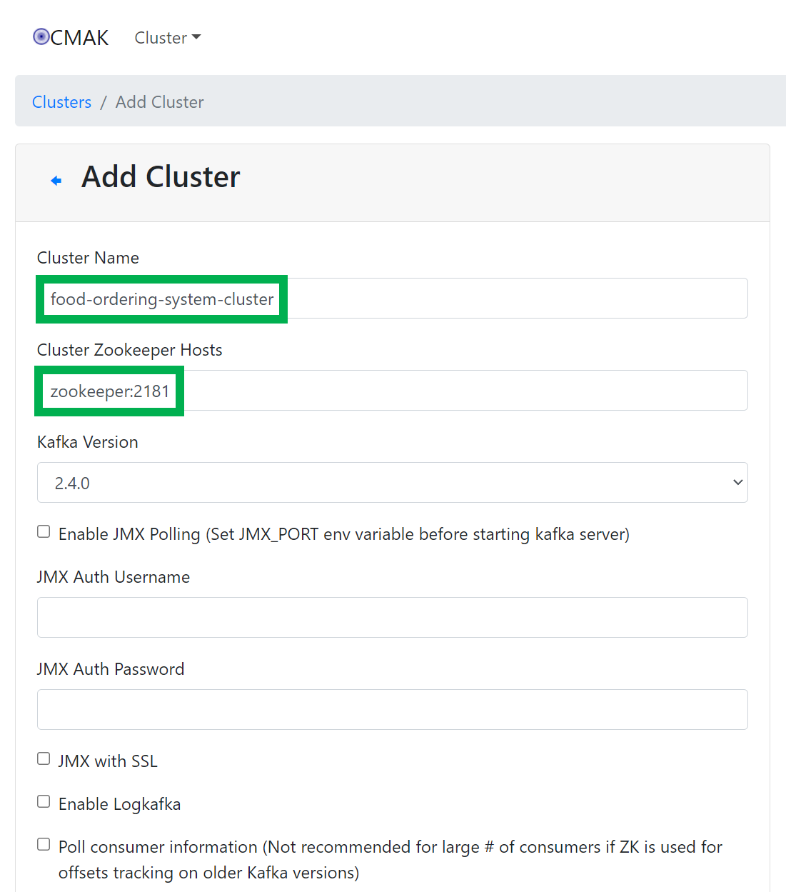
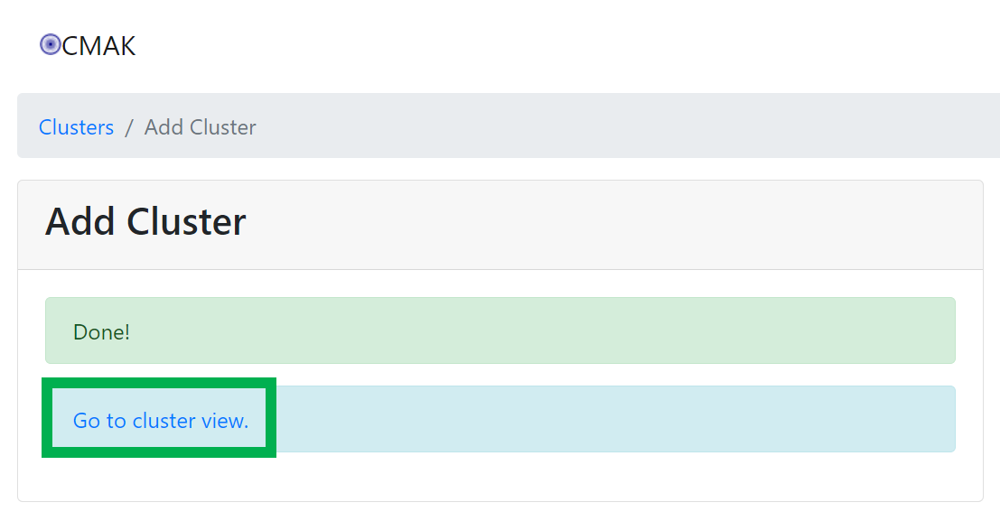
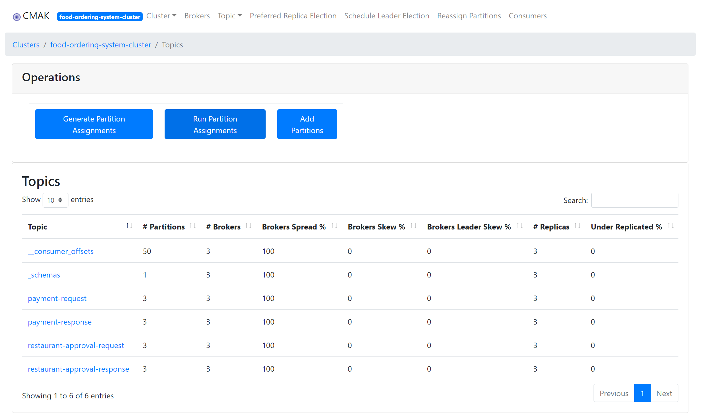
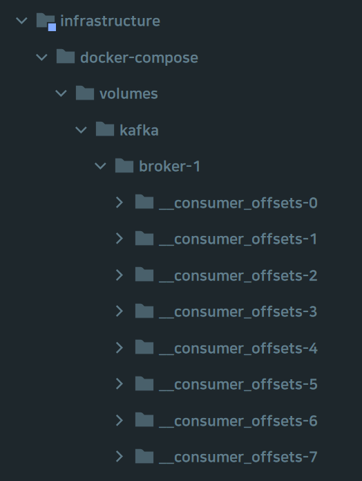

### `개발` 용도 카프카 환경 구축 가이드
내용을 좀 더 업데이트 해야 하는데, kafka-connect 컴포즈 스택 지정 방법, 싱크,소스 커넥터 사용법까지 정리해야 하는데... 

- 와... 진짜.. 이거 다 언제 정리하지... 

하면서 미루고 있는 중... 

<br>


### 포트 사용 정보 

- 2181 : zookeeper
- 8081 : schema registry
  - depends_on : broker1, broker2, broker3
- 19092 : broker1
- 29092 : broker2
- 39092 : borker3
- 9000 : kafka-manager

<br>


### env 파일 추가

docker-compose 에 대한 전역변수들이다.

```plain
KAFKA_VERSION=7.0.1
GLOBAL_NETWORK=msa-prototype
GROUP_ID=net.msa.prototype
```

- 카프카 버전은 7.0.1 로 설정했다.
- 네트워크 이름은 msa-prototype 으로 사용하기로 했다.
- 그룹 ID의 이름은 net.msa.prototype 으로 지정해줬다.

<br>


### common.yml

```yaml
version: '3.7'

networks:
  msa-prototype:
    driver: bridge
```

<br>


### zookeeper

```yaml
version: '3.7'
services:
  zookeeper:
    image: confluentinc/cp-zookeeper:${KAFKA_VERSION:-latest}
    hostname: zookeeper
    ports:
      - "2181:2181"
    environment:
      ZOOKEEPER_SERVER_ID: 1
      ZOOKEEPER_CLIENT_PORT: 2181
      ZOOKEEPER_TICK_TIME: 2000
      ZOOKEEPER_INIT_LIMIT: 5
      ZOOKEEPER_SYNC_LIMIT: 2
      ZOOKEEPER_SERVERS: zookeeper:2888:3888
      KAFKA_OPTS: "-Dzookeeper.4lw.commands.whitelist=ruok"
    volumes:
      - "./volumes/zookeeper/data:/var/lib/zookeeper/data"
      - "./volumes/zookeeper/transactions:/var/lib/zookeeper/log"
    networks:
      - ${GLOBAL_NETWORK:-kafka}
```


- version : 카프카 버전을 의미한다. '3.7' 로 지정해줬다.
- networks 는 `.env` 파일에 정의한 환경변수인 GLOBAL_NETWORK 로 지정해줬다.
- ports:
  - zookeeper 의 기본 포트는 2181 이기에 포트 번호는 2181로 지정해줬다.
- `KAFKA_OPTS: "-Dzookeeper.4lw.commands.whitelist=ruok"`
  - KAFKA_OPTS 환경변수를 추가하고, ruok 명령을 허용 목록으로 추가했다.
    이렇게 하면 ruok 명령을 사용해서 zookeeper 의 상태를 확인하는 데 도움이 된다.
- volumes
  - zookeeper 데이터, 트랜잭션에 대한 볼륨 디렉터리를 지정해줬다. 
  - docker-compose 를 구동하는 디렉터리에 volumes 디렉터리가 존재하지 않으면 생성되고 이미 존재한다면 존재하는 디렉터리에 데이터파일들이 쌓이게 된다.


<br>


### kafka_cluster.yaml

```yaml
version: '3.7'
services:
  schema-registry:
    image: confluentinc/cp-schema-registry:${KAFKA_VERSION}
    hostname: schema-registry
    depends_on:
      - kafka-broker-1
      - kafka-broker-2
      - kafka-broker-3
    ports:
      - "8081:8081"
    environment:
      SCHEMA_REGISTRY_HOST_NAME: schema-registry
      SCHEMA_REGISTRY_KAFKASTORE_CONNECTION_URL: 'zookeeper:2181'
      SCHEMA_REGISTRY_LISTENERS: http://schema-registry:8081
      SCHEMA_REGISTRY_KAFKASTORE_BOOTSTRAP_SERVERS: PLAINTEXT://kafka-broker-2:9092,LISTENER_LOCAL://localhost:29092
      SCHEMA_REGISTRY_DEBUG: 'true'
    networks:
      - ${GLOBAL_NETWORK:-kafka}
  kafka-broker-1:
    image: confluentinc/cp-kafka:${KAFKA_VERSION}
    hostname: kafka-broker-1
    ports:
      - "19092:19092"
    environment:
      KAFKA_BROKER_ID: 1
      KAFKA_ZOOKEEPER_CONNECT: zookeeper:2181
      KAFKA_ADVERTISED_LISTENERS: PLAINTEXT://kafka-broker-1:9092,LISTENER_LOCAL://localhost:19092
      KAFKA_LISTENER_SECURITY_PROTOCOL_MAP: PLAINTEXT:PLAINTEXT,LISTENER_LOCAL:PLAINTEXT
      KAFKA_INTER_BROKER_LISTENER_NAME: PLAINTEXT
      KAFKA_OFFSETS_TOPIC_REPLICATION_FACTOR: 3
      KAFKA_COMPRESSION_TYPE: producer
    volumes:
      - "./volumes/kafka/broker-1:/var/lib/kafka/data"
    networks:
      - ${GLOBAL_NETWORK:-kafka}
  kafka-broker-2:
    image: confluentinc/cp-kafka:${KAFKA_VERSION}
    hostname: kafka-broker-2
    ports:
      - "29092:29092"
    environment:
      KAFKA_BROKER_ID: 2
      KAFKA_ZOOKEEPER_CONNECT: zookeeper:2181
      KAFKA_ADVERTISED_LISTENERS: PLAINTEXT://kafka-broker-2:9092,LISTENER_LOCAL://localhost:29092
      KAFKA_LISTENER_SECURITY_PROTOCOL_MAP: PLAINTEXT:PLAINTEXT,LISTENER_LOCAL:PLAINTEXT
      KAFKA_INTER_BROKER_LISTENER_NAME: PLAINTEXT
      KAFKA_OFFSETS_TOPIC_REPLICATION_FACTOR: 3
      KAFKA_COMPRESSION_TYPE: producer
    volumes:
      - "./volumes/kafka/broker-2:/var/lib/kafka/data"
    networks:
      - ${GLOBAL_NETWORK:-kafka}
  kafka-broker-3:
    image: confluentinc/cp-kafka:${KAFKA_VERSION}
    hostname: kafka-broker-3
    ports:
      - "39092:39092"
    environment:
      KAFKA_BROKER_ID: 3
      KAFKA_ZOOKEEPER_CONNECT: zookeeper:2181
      KAFKA_ADVERTISED_LISTENERS: PLAINTEXT://kafka-broker-3:9092,LISTENER_LOCAL://localhost:39092
      KAFKA_LISTENER_SECURITY_PROTOCOL_MAP: PLAINTEXT:PLAINTEXT,LISTENER_LOCAL:PLAINTEXT
      KAFKA_INTER_BROKER_LISTENER_NAME: PLAINTEXT
      KAFKA_OFFSETS_TOPIC_REPLICATION_FACTOR: 3
      KAFKA_COMPRESSION_TYPE: producer
    volumes:
      - "./volumes/kafka/broker-3:/var/lib/kafka/data"
    networks:
      - ${GLOBAL_NETWORK:-kafka}
  kafka-manager:
    image: hlebalbau/kafka-manager:stable
    restart: always
    ports:
      - "9000:9000"
    environment:
      ZK_HOSTS: "zookeeper:2181"
    networks:
      - ${GLOBAL_NETWORK:-kafka}
```


-  스키마 레지스트리, kafka broker 3기 가 정의되었다.
-  스키마 레지스트리는 confluent 의 스키마 레지스트리 docker 이미지를 사용한다. 스키마 레지스트리는 kafka 브로커에 따라 다르다.
-  ports 는 카프카 기본포트인 8081 을 사용했다.
-  그리고 호스트 이름, 스키마 레지스트리 리스너, zookeeper url, bootstrap servers, 카프카 환경 파일 내의 kafka 버전, 전역 네트워크 변수를 사용한다.
-  kafka 브로커 각각에 대한 환경 설정
   - `kafka-broker-1.ports[0]: - "19092:19092"` 
     - kafka-broker-1 은 19092, kafka-broker-2는 29092, kafka-broker-3 는 39092 포트를 사용하게끔 지정해줬다.
   - `kafka-broker-1.image: confluentinc/cp-kafka:${KAFKA_VERSION}` 
     - Confluent Kafka Doker 이미지를 사용해서 환경을 설정한다.
   - KAFKA_ADVERTISED_LISTENERS
     - 외부에서는 19092 포트로 통신하고, 내부에서는 9092 포트를 사용한다.
-  volume 지정
   - `"./volumes/kafka/broker-3:/var/lib/kafka/data"` 으로 지정해줬다.


- `kafka-manager`
  - 카프카 브로커들을 관리하기 위한 컨테이너
  - 9000 포트를 사용한다.
  - 웹 유저 인터페이스를 이용해서 Kafka 클러스터에서 브로커와 topic 을 확인할 수 있다.


### init_kafka.yml

```yaml
version: '3.7'
services:
  init-kafka:
    image: confluentinc/cp-kafka:${KAFKA_VERSION}
    entrypoint: [ '/bin/sh', '-c' ]
    command: |
      "
      # block until kafka is reachable
      kafka-topics --bootstrap-server kafka-broker-1:9092 --list

      echo -e 'Deleting kafka topics'
      kafka-topics --bootstrap-server kafka-broker-1:9092 --topic payment-request --delete --if-exists
      kafka-topics --bootstrap-server kafka-broker-1:9092 --topic payment-response --delete --if-exists
      kafka-topics --bootstrap-server kafka-broker-1:9092 --topic restaurant-approval-request --delete --if-exists
      kafka-topics --bootstrap-server kafka-broker-1:9092 --topic restaurant-approval-response --delete --if-exists

      echo -e 'Creating kafka topics'
      kafka-topics --bootstrap-server kafka-broker-1:9092 --create --if-not-exists --topic payment-request --replication-factor 3 --partitions 3
      kafka-topics --bootstrap-server kafka-broker-1:9092 --create --if-not-exists --topic payment-response --replication-factor 3 --partitions 3
      kafka-topics --bootstrap-server kafka-broker-1:9092 --create --if-not-exists --topic restaurant-approval-request --replication-factor 3 --partitions 3
      kafka-topics --bootstrap-server kafka-broker-1:9092 --create --if-not-exists --topic restaurant-approval-response --replication-factor 3 --partitions 3


      echo -e 'Successfully created the following topics:'
      kafka-topics --bootstrap-server kafka-broker-1:9092 --list
      "
    networks:
      - ${GLOBAL_NETWORK:-kafka}
```


- image
  - 위에서 보듯 `confluentinc/cp-kafka:${KAFKA_VERSION}` 을 도커 이미지로 사용한다.

- entrypoint
  - -c 옵션과 함께 진입점 /bin/sh 를 사용한다. 그리고 명령을 실행해서 명령에서 주제를 만든다.
- networks 
  - .env 에 정의해둔 환경변수를 사용한다.
- command
  - kafka cli 를 이용해서 이미 생성된 토픽을 지우거나, 새로운 토픽을 생성하는 작업을 정의했다.
  - --delete 옵션을 사용해서 이미 존재하는 payment-request, payment-response, restaurant-approval-request, restaurant-approval-response 토픽을 모두 삭제한다.
  - --create --if-not-exists 토픽을 이용해 이미 존재하는 토픽이 있다면 payment-request, payment-response, restaurant-approval-request, restaurant-approval-response 토픽을 모두 삭제한다.
  - 데이터가 3개의 서로 다른 파티션에 보관되기에 탄력성을 높일 수 있다.
  - 클러스터에 이미 3개의 kafka 브로커를 생성했기에 replication factor 를 3 으로 설정한다.
  - `kafka-topics --bootstrap-server kafka-broker-1:9092 --list` 를 실행하는데 `--list` 옵션을 통해 모든 토픽들을 나열하겠다는 의미이다.
- command 의 명령이 모두 완료되면 이 컨테이너는 종료된다.
  - 이 컨테이너의 목적은 topic 을 만든 후에 종료하고자 하는 것이 목적이다.


<br>


### 실행

#### 주키퍼 실행

zookeeper.yml 이 있는 디렉터리에서 아래 명령을 실행

```bash
docker-compose -f common.yml -f zookeeper.yml up -d
```

<br>


주키퍼 상태 확인

```bash
$ echo ruok | nc localhost 2181
```

<br>


또는 telnet으로 아래와 같이 수행

```bash
$ telnet localhost 2181

# ruok 을 타이핑한다.

imok

```

<br>


 `echo ruok | nc localhost 2181`  명령으로 상태를 확인하는 것에 대해서는 https://zookeeper.apache.org/doc/r3.8.1/zookeeperAdmin.html#sc_zkCommands 에서 자세한 명령어의 옵션 등을 확인할 수 있다.

<br>


#### 카프카 클러스터 실행

kafka\_cluster.yml 파일이 있는 디렉터리에서 아래의 명령을 수행

```bash
$ docker-compose -f common.yml -f kafka_cluster.yml up -d
```

<br>


#### kafka 토픽 생성 작업 (init_kafka.yml)

init\_kafka.yml 파일이 있는 디렉터리로 이동해서 아래의 명령을 수행

```bash
$ docker-compose -f common.yml -f init_kafka.yml up -d
```

<br>


### 클러스터 확인

#### localhost:9000

브라우저에 http://localhost:9000/ 을 입력해 이동하면 아래와 같은 화면이 나타난다.



Cluster 메뉴를 클릭하고 Add Cluster 버튼을 클릭한다.



그리고 아래와 같이 클러스터 명과 Zookeeper host, port 를 입력해준다.



<br>


이제 Cluster 들의 상태를 확인하기 위해 Go to cluster view 링크를 클릭해본다.



<br>


아래 그림 처럼 토픽들이 나타나는 것을 볼수 있다. 지금까지의 과정은 init_kafka.yml 로 토픽을 추가해줬지만, 카프카 설치 초기에는 토픽이 있더라도 클러스터가 아직은 생성되지 않았기에 클러스터를 새로 생성 후에 토픽이 제대로 존재하는지 확인하는 과정이었다.




### .gitignore

infrastructure 모듈 내의 docker-compose/volumes/kafka/broker-1 디렉터리를 보면 갑자기 아래와 같이 수없이 많은 디렉터리가 생성되어 있음을 확인 가능하다.




\*\*/docker-compose/kafka/volumes 를 `.gitignore` 파일에 추가해준다.