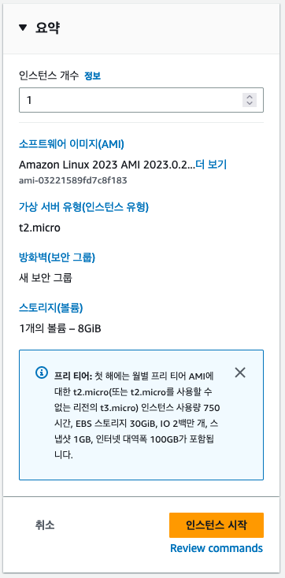
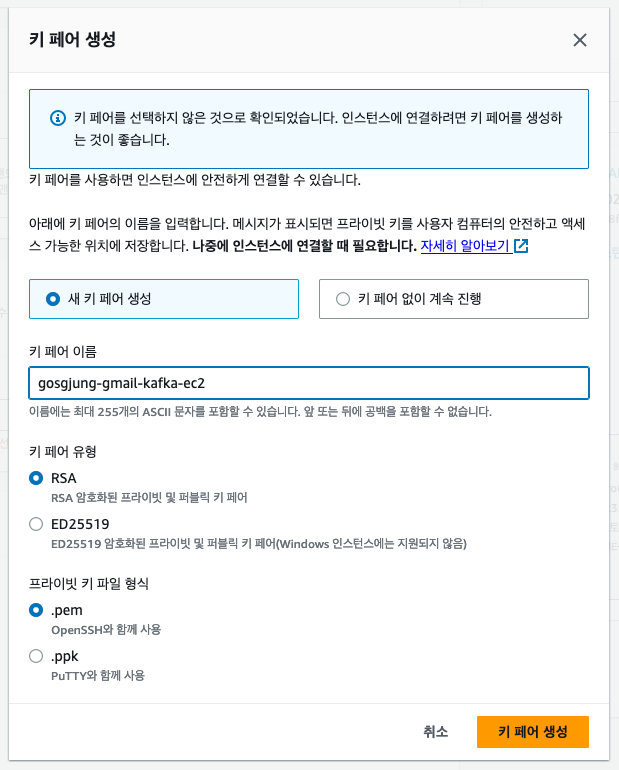
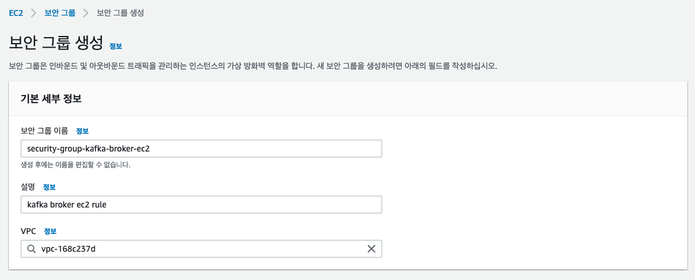
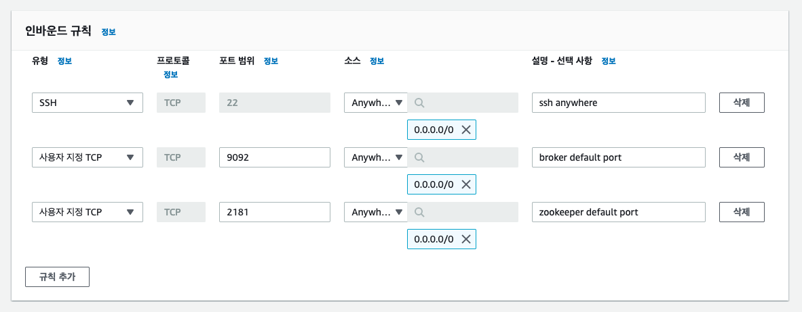
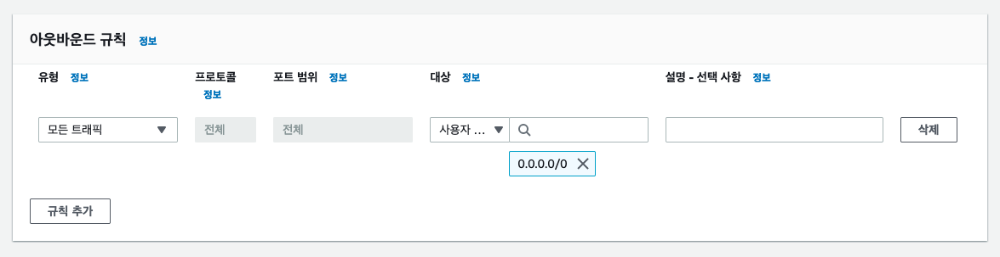

# 개발 및 테스트 용도 싱글브로커,주키퍼를 EC2에 설치하기


### ec2 설치 

OS : Amazon Linux2 선택 (Amazon Linux 2023 AMI 선택)

인스턴스 유형 : t2.micro



<br>





### Security Group

아래에 생성한 보안그룹을 EC2 에 추가해준다.










### bash 접속

```bash
$ chmod 700 gosgjung-gmail-kafka-ec2.pem
$ ssh -i gosgjung-gmail-kafka-ec2.pem ec2-user@13.125.229.217
```


### java 17 설치

참고: https://herojoon-dev.tistory.com/145

```bash
$ sudo yum install -y java-17-amazon-corretto
$ java -version
openjdk version "17.0.6" 2023-01-17 LTS
OpenJDK Runtime Environment Corretto-17.0.6.10.1 (build 17.0.6+10-LTS)
OpenJDK 64-Bit Server VM Corretto-17.0.6.10.1 (build 17.0.6+10-LTS, mixed mode, sharing)
```


### 브로커 다운로드 & 설치

다운로드

```bash
$ mkdir -p env/kafka
$ cd env/kafka/
$ wget https://downloads.apache.org/kafka/3.4.0/kafka_2.12-3.4.0.tgz
$ tar xvf kafka_2.12-3.4.0.tgz
$ cd kafka_2.12-3.4.0/
$ ls
LICENSE  NOTICE  bin  config  libs  licenses  site-docs
```


힙메모리 설정

카프카 패키지의 기본 힙 메모리는 카프카 브로커는 1G, 주키퍼는 512MB 다.

실습용으로 생성한 t2.micro 인스턴스는 1G 메모리를 가지고 있다.

카프카와 주키퍼를 동시에 실행하면 1.5G 메모리가 필요하기에 Cannot Allocate memory 에러가 출력되면서 실행이 안된다.

```bash
$ vim ~/.bashrc

export KAFKA_HEAP_OPTS="-Xmx400m -Xms400m"

:wq


$ source ~/.bashrc

$ echo $KAFKA_HEAP_OPTS
-Xmx400m -Xms400m
```


브로커 옵션 설정

- 실습용 브로커에서는 advertised.listener 만 설정해주면 된다.
- Advertised.listener 는 아래와 같은 형식으로 지정해준다. 
  - Advertised.listeners=PLAINTEXT://{EC2퍼블릭 IP}:9092 


```bash
$ vim config/server.properties


# 주석 해제 후 아래 내용 입력
advertised.listeners=PLAINTEXT://{ec2 퍼블릭 IP}:9092

esc
:wq
```


### 주키퍼 실행

카프카 바이너리에는 주키퍼 실행파일도 포함되어 있다.

상용환경에서는 주키퍼를 3대 이상의 서버로 구성해서 사용하지만 실습에서는 1대만 실행시켜서 테스트하기로 했다.

1기만 실행하는 주키퍼를 'Quick-and-dirty single-node' 라고 부른다.

```bash
$ bin/zookeeper-server-start.sh -daemon config/zookeeper.properties
$ ps -ef | grep zookeeper
```


### 브로커 실행

```bash
$ bin/kafka-server-start.sh -daemon config/server.properties
$ ps -ef | grep kafka
```


### 로컬 개발환경에 카프카 클라이언트 세팅

```bash
$ wget https://downloads.apache.org/kafka/3.4.0/kafka_2.12-3.4.0.tgz
$ tar xvf kafka_2.12-3.4.0.tgz
$ cd kafka_2.12-3.4.0
$ bin/kafka-broker-api-versions.sh --bootstrap-server 13.125.229.217:9092

{EC2퍼블릭 IP주소}:9092 (id: 0 rack: null) -> (
	Produce(0): 0 to 9 [usable: 9],
	Fetch(1): 0 to 13 [usable: 13],
	ListOffsets(2): 0 to 7 [usable: 7],
	Metadata(3): 0 to 12 [usable: 12],
	LeaderAndIsr(4): 0 to 7 [usable: 7],
	StopReplica(5): 0 to 4 [usable: 4],
	UpdateMetadata(6): 0 to 8 [usable: 8],
	ControlledShutdown(7): 0 to 3 [usable: 3],
	OffsetCommit(8): 0 to 8 [usable: 8],
	OffsetFetch(9): 0 to 8 [usable: 8],
	FindCoordinator(10): 0 to 4 [usable: 4],
	JoinGroup(11): 0 to 9 [usable: 9],
	Heartbeat(12): 0 to 4 [usable: 4],
	LeaveGroup(13): 0 to 5 [usable: 5],
	
	...

```


### 테스트 편의를 위한 hosts 편집

```bash
$ sudo vim /etc/hosts

{퍼블릭 IP 주소} gosgjung-aws-single-kafka

:wq


$ bin/kafka-broker-api-versions.sh --bootstrap-server gosgjung-aws-single-kafka:9092

{퍼블릭 IP 주소}:9092 (id: 0 rack: null) -> (
	Produce(0): 0 to 9 [usable: 9],
	Fetch(1): 0 to 13 [usable: 13],
	ListOffsets(2): 0 to 7 [usable: 7],
	Metadata(3): 0 to 12 [usable: 12],
	LeaderAndIsr(4): 0 to 7 [usable: 7],
	StopReplica(5): 0 to 4 [usable: 4],
	UpdateMetadata(6): 0 to 8 [usable: 8],
	ControlledShutdown(7): 0 to 3 [usable: 3],
	OffsetCommit(8): 0 to 8 [usable: 8],
	OffsetFetch(9): 0 to 8 [usable: 8],
	
	
	...
	
```


