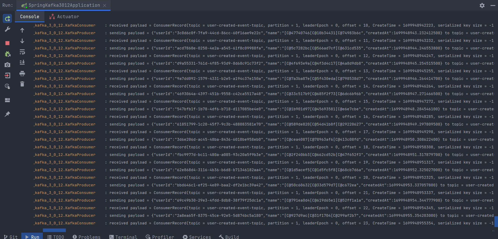

## 카프카 테스트하기 

이번문서에서는 카프카 테스트 하는 방식에 대해서만 정리. 겸사겸사 예제 코드도 추가 ㅋ

<br>


## 예제 프로젝트

예제 프로젝트는 코틀린, 스프링 부트 3.0.x 기반으로 선택.


<br>


## 의존성

```kotlin
dependencies {
	implementation("org.springframework.boot:spring-boot-starter-web")
	implementation("com.fasterxml.jackson.module:jackson-module-kotlin")
	implementation("org.springframework.kafka:spring-kafka")

  // ...
  
  testImplementation("org.springframework.boot:spring-boot-starter-test")
	testImplementation("org.springframework.kafka:spring-kafka-test")
	testImplementation("org.testcontainers:junit-jupiter")
	testImplementation("org.testcontainers:kafka")
}
```

<br>


## Configuration

Properties 사용코드도 넣을까 하다가 최대한 단순한 예제가 낫겠다 싶어서 아래 설정코드들만 추가

- KafkaProducerConfig
- KafkaConsumerConfig
- application.yml

<br>


### KafkaProducerConfig

```kotlin
package com.example.spring_kafka_3_0_12.config.kafka

import org.apache.kafka.clients.producer.ProducerConfig
import org.apache.kafka.common.serialization.StringSerializer
import org.springframework.beans.factory.annotation.Qualifier
import org.springframework.beans.factory.annotation.Value
import org.springframework.context.annotation.Bean
import org.springframework.context.annotation.Configuration
import org.springframework.kafka.core.DefaultKafkaProducerFactory
import org.springframework.kafka.core.KafkaTemplate
import org.springframework.kafka.core.ProducerFactory
import java.io.Serializable

@Configuration
class KafkaProducerConfig (
    @Value("\${spring.kafka.producer.bootstrap-servers}")
    val BOOTSTRAP_SERVERS: String,
){
    @Bean
    fun kafkaTemplate(
        @Qualifier("kafkaProducerFactory")
        kafkaProducerFactory: ProducerFactory<String, String>
    ): KafkaTemplate<String, String> {
        return KafkaTemplate(kafkaProducerFactory)
    }

    @Bean
    fun kafkaProducerFactory() : ProducerFactory<String, String> {
        return DefaultKafkaProducerFactory<String, String>(producerConfig())
    }

    fun producerConfig() : Map<String, Serializable> {
        return mapOf<String, Serializable> (
            ProducerConfig.BOOTSTRAP_SERVERS_CONFIG to BOOTSTRAP_SERVERS,
            ProducerConfig.KEY_SERIALIZER_CLASS_CONFIG to StringSerializer::class.java,
            ProducerConfig.VALUE_SERIALIZER_CLASS_CONFIG to StringSerializer::class.java
        )
    }
}
```

<br>


### KafkaConsumerConfig

```kotlin
package com.example.spring_kafka_3_0_12.config.kafka

import org.apache.kafka.clients.consumer.ConsumerConfig
import org.apache.kafka.common.serialization.StringDeserializer
import org.springframework.beans.factory.annotation.Qualifier
import org.springframework.beans.factory.annotation.Value
import org.springframework.context.annotation.Bean
import org.springframework.context.annotation.Configuration
import org.springframework.kafka.config.ConcurrentKafkaListenerContainerFactory
import org.springframework.kafka.core.ConsumerFactory
import org.springframework.kafka.core.DefaultKafkaConsumerFactory
import java.io.Serializable

@Configuration
class KafkaConsumerConfig (
    @Value("\${spring.kafka.consumer.bootstrap-servers}")
    val BOOTSTRAP_SERVERS: String,
    @Value("\${spring.kafka.consumer.auto-offset-reset}")
    val AUTO_OFFSET_RESET: String,
    @Value("\${spring.kafka.consumer.enable-auto-commit}")
    val AUTO_COMMIT: Boolean,
){
    @Bean
    fun kafkaListenerContainerFactory(
        @Qualifier("kafkaConsumerFactory") kafkaConsumerFactory: ConsumerFactory<String, String>
    ) : ConcurrentKafkaListenerContainerFactory<String, String> {
        val factory = ConcurrentKafkaListenerContainerFactory<String, String>()
        factory.setConcurrency(3)
        factory.consumerFactory = kafkaConsumerFactory
        factory.containerProperties.pollTimeout = 500
        return factory
    }

    @Bean
    fun kafkaConsumerFactory() : ConsumerFactory<String, String> {
        return DefaultKafkaConsumerFactory(consumerConfig())
    }

    fun consumerConfig(): Map<String, Serializable>{
        return mapOf<String, Serializable>(
            ConsumerConfig.BOOTSTRAP_SERVERS_CONFIG to BOOTSTRAP_SERVERS,
            ConsumerConfig.AUTO_OFFSET_RESET_CONFIG to AUTO_OFFSET_RESET,
            ConsumerConfig.ENABLE_AUTO_COMMIT_CONFIG to AUTO_COMMIT,
            ConsumerConfig.KEY_DESERIALIZER_CLASS_CONFIG to StringDeserializer::class.java,
            ConsumerConfig.VALUE_DESERIALIZER_CLASS_CONFIG to StringDeserializer::class.java
        )
    }
}
```

<br>


### application.yml

```yaml
spring:
  kafka:
    consumer:
      bootstrap-servers: localhost:29092
      auto-offset-reset: earliest
      enable-auto-commit: false
      key-deserializer: org.apache.kafka.common.serialization.StringDeserializer
      value-deserializer: org.springframework.kafka.support.serializer.ErrorHandlingDeserializer
    producer:
      bootstrap-servers: localhost:29092
      key-serializer: org.apache.kafka.common.serialization.StringSerializer
      value-serializer: org.springframework.kafka.support.serializer.JsonSerializer
    listener:
      ack-mode: manual

embedded-test:
  kafka:
    user-created-event-topic: user-created-event-topic
```

<br>


## Producer, Consumer

### KafkaProducer

```kotlin
package com.example.spring_kafka_3_0_12

import org.slf4j.Logger
import org.slf4j.LoggerFactory
import org.springframework.kafka.core.KafkaTemplate
import org.springframework.stereotype.Component

@Component
class KafkaProducer (
    val kafkaTemplate: KafkaTemplate<String, String>
){
    private val logger : Logger = LoggerFactory.getLogger(javaClass)

    fun send(topic: String, payload: String){
        val msg = StringBuilder()
            .append("sending payload = $payload ")
            .append("to topic = $topic")
            .toString()

        logger.info(msg)

        kafkaTemplate.send(topic, payload)
    }
}
```

<br>


### KafkaConsumer

```kotlin
package com.example.spring_kafka_3_0_12

import org.apache.kafka.clients.consumer.ConsumerRecord
import org.slf4j.Logger
import org.slf4j.LoggerFactory
import org.springframework.kafka.annotation.KafkaListener
import org.springframework.stereotype.Component

@Component
class KafkaConsumer {
    private val logger : Logger = LoggerFactory.getLogger(javaClass)

    @KafkaListener(
        id = "order-created-topic-consumer",
        topics = ["user-created-event-topic"]
    )
    fun receive(consumerRecord: ConsumerRecord<String,String>){
        val payload = consumerRecord.toString()
        val message = StringBuilder()
            .append("received payload = ").append(payload)
            .toString()

        logger.info(message)
    }

}
```

<br>


## 로컬 테스트 용 시뮬레이터 + 로컬 docker 테스트 

1초에 한번씩 KafkaProducer 를 이용해서 데이터를 생산하는 코드다. 별 내용은 없지만, 흐름을 읽으려면 필요하기에 추가함.

임의의 이름을 만들때 kotlin-faker 를 사용할수도 있지만 갑자기 드는 생각...이 있었다.

- 이런 간단한 코드도 의존성 라이브러리 추가할꺼야? 그렇게 파이팅이 읍냐? 

그래서 이름을 무작위로 생성할 때 그냥 random string 기반으로 3글자의 이름을 만드는 단순 코드를 사용했다.

<br>


### UserCreatedEventPublisher

```kotlin
package com.example.spring_kafka_3_0_12.simulator

import com.example.spring_kafka_3_0_12.KafkaProducer
import com.example.spring_kafka_3_0_12.valueobject.UserCreatedEvent
import com.fasterxml.jackson.databind.ObjectMapper
import org.springframework.beans.factory.annotation.Qualifier
import org.springframework.beans.factory.annotation.Value
import org.springframework.scheduling.annotation.Scheduled
import org.springframework.stereotype.Component
import java.lang.StringBuilder
import java.time.LocalDateTime
import java.time.ZonedDateTime
import java.util.UUID

@Component
class UserCreatedEventPublisher (
    val kafkaProducer: KafkaProducer,
    @Qualifier("nullableObjectMapper")
    val objectMapper: ObjectMapper,
    @Value("\$embedded-test.kafka.user-created-event-topic")
    val userCreatedEventTopic: String,
){

    @Scheduled(
        initialDelayString = "3000",
        fixedDelayString = "1000",
    )
    fun scheduleUserCreatedEvent(){
        val userCreatedEvent = UserCreatedEvent(
            userId = UUID.randomUUID(),
            name = getRandomName(),
            createdAt = ZonedDateTime.now()
        )
        kafkaProducer.send("user-created-event-topic", objectMapper.writeValueAsString(userCreatedEvent))
    }

    fun getRandomName() : String{
        return StringBuilder()
            .append(getRandomAlphabet())
            .append(getRandomAlphabet())
            .append(getRandomAlphabet())
            .toString()
    }

    fun getRandomAlphabet() : String{
        val t = LocalDateTime.now().nano % 60
        return Character.toChars(t).toString()
    }
}
```

<br>


### 로컬 docker

로컬 도커는 [여기](https://github.com/chagchagchag/kafka-study-archive/tree/main/%ED%85%8C%EC%8A%A4%ED%8C%85/example-code/spring_kafka_3_0_12/docker-compose/docker-kafka)에 정리해두었다. 문서가 길어지면 점점 호흡이 가빠져올 수 있기에 링크로 대체.

<br>


### 로컬 WAS 구동 &  확인



<br>


## EmbeddedKafka 기반 테스트 (단순 버전)

읏.... 잠깐 쉬었다가...

## TestContainer Kafka 기반 테스트 (단순 버전)

헙... 이것도 잠깐 쉬었다가... 허리가...