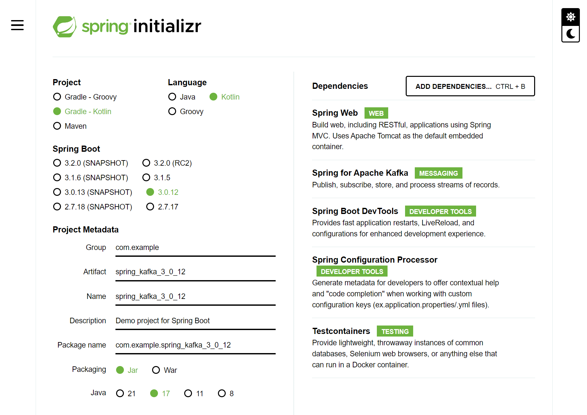

## 카프카 테스트하기 

예전에 만들어둔 <u>스프링 카프카 연동방법</u> 문서도 있는데 이번에는 테스트 코드로 카프카 테스트를 하는 방법을 정리하기로 했다. 그리고 이번에는 작성하는 스프링 카프카 테스트 코드 예제도 코드로 올려두기로 했다. (이번엔 진짜 백업 확실히 하자!!! 하는 생각으로...)

그리고 이전에 작성한 <u>스프링 카프카 연동방법 문서</u>에서 다뤘던 예제 코드도 추가해두기로 했다. 설명과 스샷은 남겼지만, 예제 코드 원본을 잃어버려서 이번 기회에 스프링 카프카 코드를 아예 템플릿처럼 만들어둬야 겠다 싶었다.

## 테스트코드로 카프카 테스트시 장점

테스트 코드로 스프링 카프카를 실제 사용 중인 카프카 인프라를 연동하지 않고 테스트할 수 있으면 좋은 점은 1차적인 필터링 테스트가 가능하다는 점인 것 같다. 뭔가 프로퍼티나 속성값을 수정했는데, 테스트 코드 레벨에서 이런 것들을 배포 전에 1차적으로 찾아내면 좋다. 

그리고 테스트 코드 없이 개발서버에서 일일이 수작업으로 테스트한다고 하더라도 일일이 사람이 머리로 추론해가면서 있을 수 있는 버그를 찾는 것은 쉽지 않다. 자주 확인하는 부분들은 테스트코드로 남겨두면 생산성이 올라간다. 잠깐 장점들을 생각해보니 이런 장점들? 이지 않을까 싶었다.

### 예제 프로젝트

예제 프로젝트는 코틀린, 스프링 부트 3.0.x 기반으로 선택.

 

